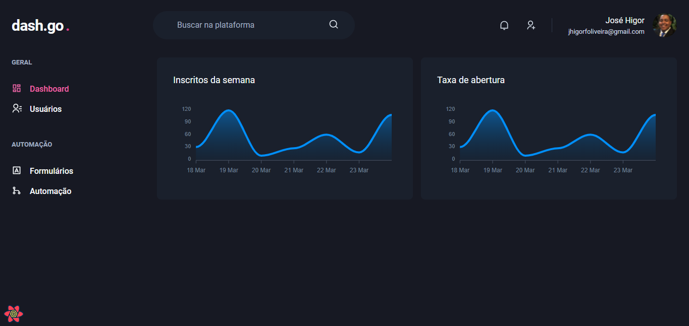
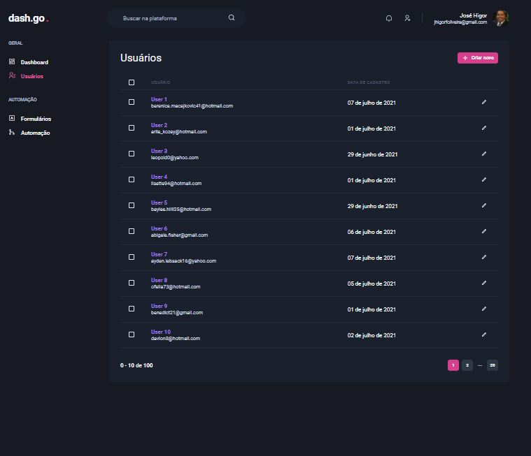
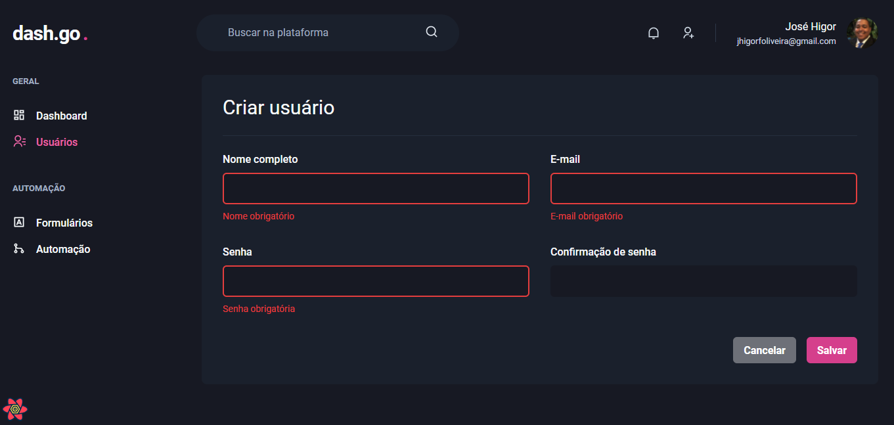
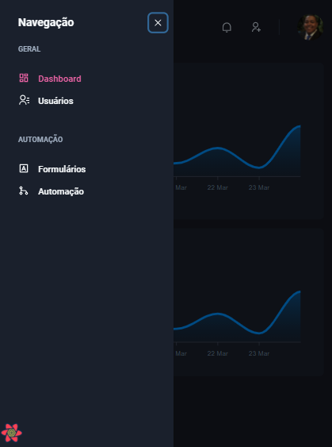
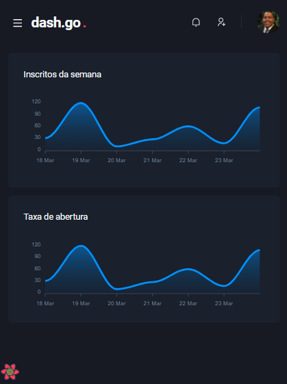

<h1 align="center"> Dashgo .</h1>

 Página do dashboard: 

---

 Página dos usuários:

---

 Página de criação de usuário: 

---

 Verão mobile - Menu / Versão mobile 
 
 

## 💻 Projeto:
Terceiro projeto desenvolvido durante o BootCamp da Rocketseat pelo Ignite - trilha ReactJS. 

Dashgo . é uma aplicação de um dasboard moderno para criação de usuários, utilização de gráficos e versão mobile.  

O proejto foi desenvolvido utilizando o framework Next.js com Chakra UI, uma biblioteca de componentes do React que facilita a construção da IU, 
Yup para construtor de esquema JavaScript para análise e validação dos dados e React Apex Charts que é uma biblioteca javascript que possibilitou criar os gráficos.

## 🚀 Tecnologias: 

  As seguintes ferramentas foram usadas no desenvolvimento dessa aplicação:
    <ul>
      <li><a href="https://pt-br.reactjs.org/">ReactJS</a></li>
      <li><a href="https://nextjs.org/">Next.js</a></li>
      <li><a href="https://www.typescriptlang.org/">TypeScript</a></li>
      <li><a href="https://chakra-ui.com/">Chakra UI</a></li>
      <li><a href="https://github.com/jquense/yup">Yup</a></li>
      <li><a href="https://apexcharts.com/docs/react-charts/">React Apex Charts</a></li>       
    </ul>
 

## :octocat: Para executar o projeto localmente basta clonar este repositório: 

`git clone https://github.com/zehigor10/dash-go.git`

<h3> Acesse o :open_file_folder: diretório dashgo </h3>

`cd dashgo`

<h3> Instale todas as :books: bibliotecas presentes no projeto com o comando: </h3>

`yarn`

 <h3> Agora basta executar o projeto :tada: </h3>
 
 `yarn dev`
 
O projeto irá rodar no endereço: <a> http://localhost:3000 </a> 
